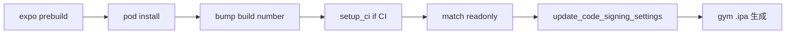

# 4-B. Fastlane Match Build on GHA

ワークフロー: `[.github/workflows/ios-fastlane-match-build.yml](../.github/workflows/ios-fastlane-match-build.yml)`

fastlane match は **証明書・プロビジョニングプロファイルを別の非公開 Git リポジトリ** に暗号化して保存します。アプリのソースコードとは分離して管理するのが前提です。

このドキュメントは次の順番で読みます。

1. **[証明書用 Git リポジトリの作成](#証明書用-git-リポジトリの作成)** — 管理者が一度だけ行う（GitHub 上でのリポジトリ作成〜 CI アクセス設定まで）
2. **[Fastlane の使い方](#fastlane-の使い方)** — ローカル環境の準備、証明書の同期、ビルド、CI 実行

## どの手順を読むか

| あなたの状況 | 読むセクション |
|---|---|
| 証明書用リポジトリがまだない（初回・Apple Developer の Admin 権限あり） | [証明書用 Git リポジトリの作成](#証明書用-git-リポジトリの作成) → [Fastlane の使い方（管理者）](#管理者初回の証明書登録) |
| 証明書用リポジトリは既にある、または管理者から URL / パスワードをもらった | [Fastlane の使い方（参加者）](#参加者証明書の同期とビルド) |
| 証明書用リポジトリを使わずにビルドしたい | [代替手段](#代替手段証明書用リポジトリを使わない場合) |

## `fastlane match init` について

ゼロから fastlane を導入する場合、公式では次の流れが一般的です。

```bash
fastlane match init          # Matchfile を対話形式で作成
fastlane match appstore      # 証明書を作成して Git リポジトリへ push
fastlane match appstore --readonly  # 他の Mac で証明書を同期
```

**このテンプレートでは `match init` は不要です。** `fastlane/Matchfile` が既にあり、環境変数（`MATCH_GIT_URL` など）経由で CI とローカルの両方から同じ設定を使えるようになっています。`match init` を実行すると既存の `Matchfile` が上書きされる可能性があるため、実行しないでください。

| やりたいこと | 公式コマンド（このテンプレートで推奨） | テンプレートのレーン（同等） |
|---|---|---|
| 初回の証明書作成 | `bundle exec fastlane match appstore` | `bundle exec fastlane ios certificates_renew` |
| 証明書の同期のみ | `bundle exec fastlane match appstore --readonly` | `bundle exec fastlane ios certificates` |
| ビルドのみ | `bundle exec fastlane ios build` | — |
| TestFlight アップロードのみ | `bundle exec fastlane ios upload` | — |
| ビルド + TestFlight | `bundle exec fastlane ios beta` | `build` → `upload` |

`match init` が担うのは **Matchfile の作成だけ** です。GitHub 上での証明書用リポジトリ作成や PAT の設定は、引き続き [証明書用 Git リポジトリの作成](#証明書用-git-リポジトリの作成) の手順が必要です。

---

## 証明書用 Git リポジトリの作成

**Apple Developer Program の Admin 権限を持つ人が、チームで一度だけ** 実行します。参加者はこのセクションをスキップし、管理者から共有された情報だけで [Fastlane の使い方](#fastlane-の使い方) に進んでください。

### 前提

| 項目 | 内容 |
|---|---|
| 必要な権限 | Apple Developer Program の **Admin**（証明書の新規作成に必要） |
| GitHub アカウント | 組織または個人アカウントでリポジトリを作成できること |
| リポジトリの用途 | **証明書・プロビジョニングプロファイル専用**（アプリのソースコードは入れない） |

### 1. GitHub 上で空の非公開リポジトリを作成する

1. GitHub にログインし、右上の **+** → **New repository** を開く
2. 以下のように設定する

   | 項目 | 推奨値 | 理由 |
   |---|---|---|
   | Owner | 組織（`your-org`）または個人 | チームで共有しやすいのは組織リポジトリ |
   | Repository name | `ios-certificates` など | アプリ名と分かる名前にする |
   | Description | （任意）`fastlane match certificates` | 用途が分かるメモ |
   | Visibility | **Private** | 証明書関連ファイルを含むため必須 |
   | Add a README file | **オフ** | 空のリポジトリにする（match が初回 push する） |
   | Add .gitignore | **None** | 同上 |
   | Choose a license | **None** | 同上 |

3. **Create repository** をクリックする
4. 作成後に表示される HTTPS URL を控える

   ```text
   https://github.com/your-org/ios-certificates.git
   ```

   以降、この URL を `MATCH_GIT_URL` として使います。

> **注意**
> - このリポジトリにはアプリの `App.tsx` や `ios/` フォルダなどは **絶対にコミットしない**
> - `fastlane match` が実行されると、暗号化された証明書ファイルが自動で push される

### 2. 暗号化パスワード（`MATCH_PASSWORD`）を決める

match はリポジトリ内のファイルを `MATCH_PASSWORD` で暗号化します。**管理者が強力なパスワードを決め**、1Password などの安全な経路でチームに共有します。

```bash
# 例: ランダムなパスワードを生成する（macOS）
openssl rand -base64 32
```

- 一度決めたら **変更しない**（変更すると既存の証明書ファイルを復号できなくなる）
- GitHub Secrets・`fastlane/.env`・チャットには平文で貼らない（パスワードマネージャー経由で共有）

### 3. リポジトリへのアクセス方法を設定する（HTTPS + PAT）

CI（GitHub Actions）とローカル開発の両方から証明書リポジトリにアクセスできるよう、HTTPS + Personal Access Token（PAT）を使います。

**3-1. GitHub で PAT を作成する**

1. GitHub → **Settings** → **Developer settings** → **Personal access tokens**
2. Fine-grained または Classic トークンを作成する
3. 証明書リポジトリへの **Contents: Read** 権限を付与する

> 初回の `certificates_renew`（証明書の新規作成）は管理者のローカル Mac から行うため、管理者の PAT には **Contents: Write** も必要です。CI 用の `MATCH_GIT_BASIC_AUTHORIZATION` は読み取り専用（Read）のままにします。

**3-2. Basic 認証文字列を base64 化する**

```bash
# username は GitHub のユーザー名、token は PAT
echo -n "your-github-username:ghp_xxxxxxxxxxxx" | base64
```

**3-3. アプリリポジトリの GitHub Secret に登録する**

UI または [GitHub CLI](https://cli.github.com/)（`gh`）で登録します。一覧は [docs/secrets-and-env.md](./secrets-and-env.md) の **4-B** を参照。

```bash
# HTTPS + PAT の例
gh secret set MATCH_GIT_BASIC_AUTHORIZATION --body "$(echo -n 'your-github-username:ghp_xxx' | base64)"
gh secret set MATCH_GIT_URL --body "https://github.com/your-org/ios-certificates.git"
```

### 4. アプリリポジトリに Secrets / Variables を登録する

証明書リポジトリとは別に、**アプリのリポジトリ**（このテンプレート）にも CI 用の値を登録します。

| 種別 | 名前 | 用途 |
|---|---|---|
| Secret | `MATCH_GIT_URL` | 証明書リポジトリの URL |
| Secret | `MATCH_PASSWORD` | match の暗号化パスワード |
| Secret | `MATCH_GIT_BASIC_AUTHORIZATION` | 証明書リポへのアクセス（HTTPS + PAT） |
| Secret | `APPLE_ID` / `APPLE_TEAM_ID` | Apple 開発者アカウント情報 |
| Secret | `APP_STORE_CONNECT_API_KEY_*` | TestFlight アップロード（`beta` レーン時） |
| Variable | `APP_IDENTIFIER` | Bundle ID |
| Variable | `SCHEME_NAME` | Xcode スキーム名 |
| Variable | `MATCH_TYPE` | 通常は `appstore` |

```bash
# Secrets
gh secret set MATCH_GIT_URL --body "https://github.com/your-org/ios-certificates.git"
gh secret set MATCH_PASSWORD --body "your-match-password"
gh secret set MATCH_GIT_BASIC_AUTHORIZATION --body "$(echo -n 'username:ghp_xxx' | base64)"
gh secret set APPLE_ID --body "you@example.com"
gh secret set APPLE_TEAM_ID --body "XXXXXXXXXX"
gh secret set APP_STORE_CONNECT_API_KEY_ID --body "3P6949Z9V8"
gh secret set APP_STORE_CONNECT_API_KEY_ISSUER_ID --body "xxxxxxxx-xxxx-xxxx-xxxx-xxxxxxxxxxxx"
gh secret set APP_STORE_CONNECT_API_KEY_P8 < <(base64 -i AuthKey_XXXXX.p8 | tr -d '\n')

# Variables
gh variable set APP_IDENTIFIER --body "com.testkun08080.template-expo-build"
gh variable set SCHEME_NAME --body "templateexpobuild"
gh variable set MATCH_TYPE --body "appstore"
```

### 5. 参加者へ共有する情報

証明書リポジトリの作成が完了したら、以下を安全な経路（1Password 等）で共有します。

| 共有するもの | 用途 |
|---|---|
| `MATCH_GIT_URL` | 証明書リポジトリの URL |
| `MATCH_PASSWORD` | match の暗号化パスワード |
| `APP_IDENTIFIER` / `APPLE_TEAM_ID` | ビルド設定 |
| リポジトリへの読み取りアクセス | ローカルで clone する場合（PAT） |

### 6. match 実行後にリポジトリへ入るもの

管理者が [初回の証明書登録](#管理者初回の証明書登録) を実行すると、証明書リポジトリに次のようなファイルが **暗号化された状態** で push されます。

```text
ios-certificates/
├── README.md          # match が自動生成
├── certs/
│   └── distribution/
│       └── *.cer      # 暗号化済み
├── profiles/
│   └── appstore/
│       └── *.mobileprovision  # 暗号化済み
└── ...
```

リポジトリを手動で編集したり、証明書ファイルを平文で追加したりしないでください。更新は常に `fastlane match` 経由で行います。

---

## Fastlane の使い方

証明書用リポジトリの準備ができたら、fastlane で証明書の同期・ビルド・TestFlight 提出を行います。

### ローカル環境のセットアップ

fastlane は **プロジェクト内の Bundler** で動かします。macOS 付属の Ruby やグローバルに入れた fastlane は使わないでください（Ruby が混在すると `pod install` が失敗しやすい）。

#### 必要なもの

| ツール | インストール | 用途 |
|---|---|---|
| Ruby 3.3 | `brew install ruby` または rbenv | CI と同じバージョン（`fastlane/.ruby-version` 参照） |
| CocoaPods | `brew install cocoapods` | `pod install`（Homebrew 版で OK） |
| Node.js | `npm install`（リポジトリ直下） | `expo prebuild` |

fastlane 本体は **グローバルに入れない**。`cd fastlane && bundle install` で `vendor/bundle` に入る。

#### 初回セットアップ

```bash
npm install
cd fastlane
bundle install
bundle exec fastlane --version
```

Homebrew の Ruby 3.3 を使う場合は PATH を通してから実行する。

```bash
export PATH="/opt/homebrew/opt/ruby/bin:$PATH"
cd fastlane
bundle install
bundle exec fastlane --version
```

#### いらないものをアンインストールする

以前 `sudo gem install fastlane` や `brew install fastlane` した場合、PATH 上で古い fastlane が優先されて壊れます。

```bash
# 1. システム Ruby に入った fastlane を削除（パスワード入力あり）
sudo gem uninstall fastlane fastlane-sirp -a -x -I

# 2. Homebrew のグローバル fastlane を削除
brew uninstall fastlane

# 3. 確認：グローバル fastlane が無いこと
which -a fastlane   # 何も出なければ OK
ruby -v             # ruby 3.3.x
```

#### トラブルシューティング

| 症状 | 対処 |
|---|---|
| `Your Ruby version is 2.6.10, but your Gemfile specified ~> 3.3.0` | システム Ruby を使っている。`export PATH="/opt/homebrew/opt/ruby/bin:$PATH"` してから `bundle exec` |
| `Your user account isn't allowed to install to the system RubyGems` | 同上。`bundle install` をプロジェクト内で実行 |
| `Could not find json / nkf / digest-crc in locally installed gems` | Ruby が混在。グローバル fastlane を削除し、`cd fastlane && rm -rf vendor/bundle .bundle && bundle install` |
| `pod install` が exit 1 | まず `cd ios && pod install` を単体で試す。CocoaPods は `brew install cocoapods` を使う |

---

### 管理者：初回の証明書登録

[証明書用 Git リポジトリの作成](#証明書用-git-リポジトリの作成) が完了していることを確認してから実行します。**参加者はこの手順を実行しないでください。**

#### 1. 環境変数を設定する

`fastlane/.env.example` をコピーして `fastlane/.env` を作成し、実際の値を入れます（`.env` はコミットしない）。

```bash
cp fastlane/.env.example fastlane/.env
```

```bash
# fastlane/.env
MATCH_GIT_URL=https://github.com/your-org/ios-certificates.git
MATCH_PASSWORD=your-match-password
MATCH_TYPE=appstore
APP_IDENTIFIER=com.example.expomultibuildtemplate
APPLE_ID=you@example.com
APPLE_TEAM_ID=XXXXXXXXXX
```

#### 2. 証明書を作成してリポジトリに登録する

```bash
cd fastlane
bundle exec fastlane match appstore
```

`fastlane match appstore` は Apple Developer Portal 上に Distribution 証明書と App Store 用プロビジョニングプロファイルを **新規作成** し、`MATCH_PASSWORD` で暗号化して証明書リポジトリへ push します。

同等のレーンも使えます: `bundle exec fastlane ios certificates_renew`

初回実行時に Apple ID の二要素認証を求められる場合があります。対話形式の入力が必要なため、**CI ではなく管理者の Mac から** 実行してください。

#### 3. 登録結果を確認する

1. 証明書リポジトリ（`your-org/ios-certificates`）に `certs/` `profiles/` が追加されていること
2. ローカルの Keychain に証明書がインストールされていること
3. 次のコマンドがエラーなく通ること

```bash
bundle exec fastlane match appstore --readonly
```

---

### 参加者：証明書の同期とビルド

管理者から `MATCH_GIT_URL`・`MATCH_PASSWORD` などを受け取っている場合は、リポジトリの作成と `certificates_renew` は **スキップ** できます。

#### 1. 依存関係をインストールする

[ローカル環境のセットアップ](#ローカル環境のセットアップ) を参照。

```bash
npm install
cd fastlane
bundle install
```

#### 2. 環境変数を設定する

管理者からもらった値を `fastlane/.env` に書く。

```bash
# fastlane/.env
MATCH_GIT_URL=https://github.com/your-org/ios-certificates.git
MATCH_PASSWORD=your-match-password
MATCH_TYPE=appstore
APP_IDENTIFIER=com.testkun08080.template-expo-build
APPLE_ID=you@example.com
APPLE_TEAM_ID=XXXXXXXXXX
```

TestFlight アップロードまで行う場合は App Store Connect API Key も追加する。

```bash
APP_STORE_CONNECT_API_KEY_ID=XXXXXXXXXX
APP_STORE_CONNECT_API_KEY_ISSUER_ID=xxxxxxxx-xxxx-xxxx-xxxx-xxxxxxxxxxxx
APP_STORE_CONNECT_API_KEY_P8=$(base64 -i AuthKey_XXXXX.p8)
```

#### 3. 証明書を同期する（読み取り専用）

```bash
cd fastlane
bundle exec fastlane match appstore --readonly
```

`--readonly` 付きは既存の証明書を **取得して Keychain にインストールするだけ** です。新規作成はしません。

同等のレーン: `bundle exec fastlane ios certificates`

#### 4. ビルド・アップロードを実行する

| レーン | コマンド | 内容 |
|---|---|---|
| `build` | `bundle exec fastlane ios build` | prebuild → ビルド番号設定 → 署名 → `.ipa` 生成 |
| `upload` | `bundle exec fastlane ios upload` | 既存 `.ipa` を TestFlight にアップロード |
| `beta` | `bundle exec fastlane ios beta` | `build` + `upload`（連続実行） |

```bash
# ビルドのみ
bundle exec fastlane ios build

# ビルド済み .ipa を TestFlight にアップロード
bundle exec fastlane ios upload

# ビルド + TestFlight アップロード
bundle exec fastlane ios beta
```

`upload` は `build/templateexpobuild.ipa`（または `IPA_PATH` 環境変数）を使います。別パスを指定する場合:

```bash
IPA_PATH=/path/to/app.ipa bundle exec fastlane ios upload
```

#### ビルド番号・バージョンの扱い

| 項目 | 設定場所 | インクリメント |
|---|---|---|
| マーケティングバージョン（`1.0.0`） | `app.json` の `expo.version` | **手動**で更新（リリース時） |
| ビルド番号（`CFBundleVersion`） | `app.json` の `expo.ios.buildNumber`（初期値） | ビルド時に自動設定 |

`build` レーンは `expo prebuild` のあと、次の優先順位でビルド番号を決めます。

1. **`BUILD_NUMBER` 環境変数**（GHA では `github.run_number` を自動設定）
2. **App Store Connect API キーがある場合** — TestFlight の最新ビルド番号 + 1
3. **上記がない場合** — `app.json` の `ios.buildNumber` をそのまま使用

> `upload` レーンはビルド番号を変更しません。同じ `.ipa` を再アップロードすると Apple に拒否されるため、再提出時は必ず `build` で新しいビルド番号の `.ipa` を作ってください。

`build` レーンの処理の流れ:



> **Expo でも `xcodeproj` を使う理由**
> `expo prebuild` で `ios/*.xcodeproj` が生成され、`gym`（xcodebuild）はこの Xcode プロジェクトをビルドします。prebuild 直後は自動署名（Development 証明書）になっているため、`match` のあと `update_code_signing_settings` で App Store 用の Distribution 証明書・プロファイルを `xcodeproj` に反映します。

> **CI での `setup_ci`**
> GitHub Actions などヘッドレス環境では、`login.keychain` に証明書を入れると `codesign` が UI 権限ダイアログ待ちでハングします。`setup_ci` が一時 keychain を作成し、非対話で署名できるようにします。

---

### CI での実行

ローカルと同じ `build` / `upload` / `beta` レーンを GitHub Actions から実行できます。ワークフロー: [`.github/workflows/ios-fastlane-match-build.yml`](../.github/workflows/ios-fastlane-match-build.yml)

ビルドと TestFlight アップロードは **別ジョブ** に分かれており、どちらか一方だけ実行できます。

| 実行方法 | ジョブ | 内容 |
|---|---|---|
| `ios-v*` タグを push | `build` → `upload` | ビルド後に TestFlight へアップロード |
| 手動 `lane: build` | `build` のみ | `.ipa` を Artifacts に保存 |
| 手動 `lane: upload` | `upload` のみ | 過去の build 実行の Artifacts からアップロード |
| 手動 `lane: beta` | `build` → `upload` | ビルド + TestFlight |

#### upload のみ実行する場合

1. 先に `lane: build` を実行し、Actions の Run URL から **Run ID** を控える（URL の末尾の数字）
2. **iOS Fastlane Match Build** → Run workflow
   - `lane`: `upload`
   - `artifact_run_id`: 手順 1 の Run ID

#### GitHub Secrets / Variables の登録

必要なキー一覧・ローカルとの対応表は [docs/secrets-and-env.md](./secrets-and-env.md) の **4-B** を参照してください。

- **UI**: リポジトリ → Settings → Secrets and variables → Actions
- **CLI**: `gh secret set` / `gh variable set`（[証明書用 Git リポジトリの作成](#4-アプリリポジトリに-secrets--variables-を登録する) のコマンド例を参照）

> `MATCH_GIT_URL` は `https://` 形式にし、`MATCH_GIT_BASIC_AUTHORIZATION` を設定してください。

#### 自動実行

`ios-v*` タグを push すると `beta` レーンが自動実行されます。

```bash
git tag ios-v1.0.0
git push origin ios-v1.0.0
```

#### 手動実行

GitHub Actions → **iOS Fastlane Match Build** → **Run workflow**

- `lane`: `build` / `upload` / `beta`
- `artifact_run_id`: `upload` のみ実行時に、過去の build 実行の Run ID を指定

#### ビルド成果物

`build` / `beta` 実行後、Actions の **Artifacts** から `.ipa` をダウンロードできます（14 日間保持、名前: `ios-ipa`）。

#### ビルド番号（CI）

GHA の `build` ジョブは `BUILD_NUMBER=${{ github.run_number }}` を自動設定します。同じ `version` でも Run ごとにユニークなビルド番号になり、TestFlight への再アップロードが可能です。

#### ローカルと CI の環境変数対応

| 用途 | ローカル（`fastlane/.env`） | CI（GitHub Secrets） |
|---|---|---|
| 証明書リポジトリ | `MATCH_GIT_URL` | `MATCH_GIT_URL` |
| match パスワード | `MATCH_PASSWORD` | `MATCH_PASSWORD` |
| 証明書リポへのアクセス | PAT | `MATCH_GIT_BASIC_AUTHORIZATION` |
| TestFlight 提出 | `APP_STORE_CONNECT_API_KEY_PATH`（.p8 パス） | `APP_STORE_CONNECT_API_KEY_P8`（base64） |
| ビルド番号（CI） | `BUILD_NUMBER`（任意） | `github.run_number` を自動設定 |
| Bundle ID | `APP_IDENTIFIER` | Variable `APP_IDENTIFIER` |

詳細は [docs/secrets-and-env.md](./secrets-and-env.md) の **4-B** を参照。

---

### 確認

1. App Store Connect → **TestFlight** → **Builds** で Processing 完了を確認する
2. **Internal Testing** グループにビルドを割り当て、テスターを追加する

---

## 代替手段（証明書用リポジトリを使わない場合）

証明書用リポジトリの運用が難しい、または Admin 権限がない場合は、次の方法を検討する。

| 方法 | ドキュメント | 証明書管理 |
|---|---|---|
| EAS Cloud Build | [docs/02-eas-cloud-build.md](./02-eas-cloud-build.md) | EAS が管理 |
| EAS on GHA | [docs/04-github-actions-eas-build.md](./04-github-actions-eas-build.md) | EAS が管理 |
| Xcode Cloud | [docs/03-xcode-cloud.md](./03-xcode-cloud.md) | Apple が自動管理 |
| Local EAS Build | [docs/01-local-eas-build.md](./01-local-eas-build.md) | 手元の Keychain |
